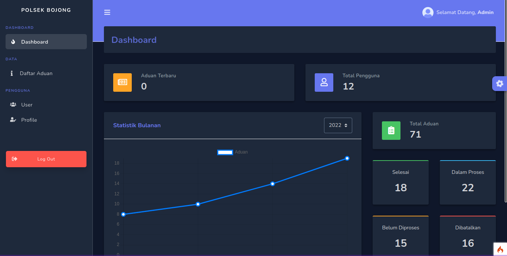
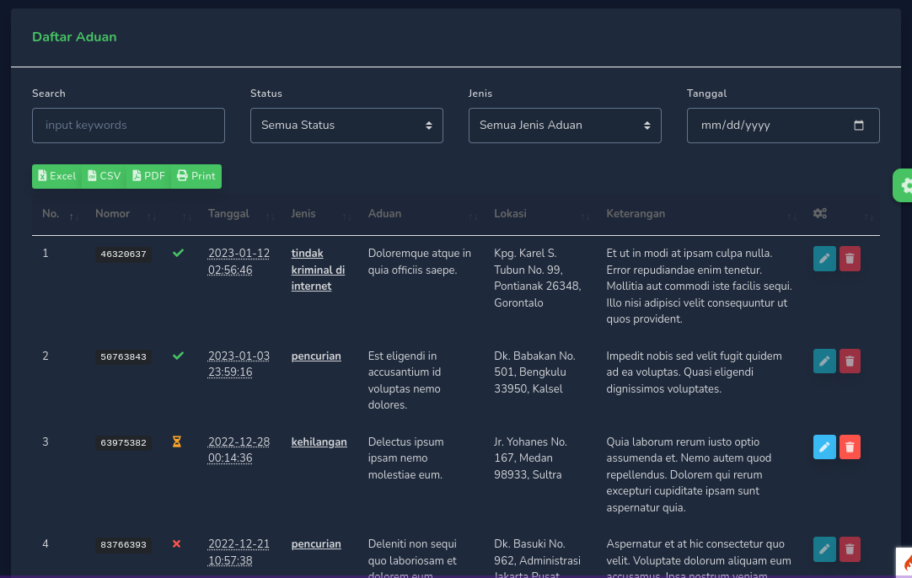

# Aplikasi aduan kepolisian
aduan kepolisian adalah aplikasi yang digunakan untuk melaporkan kejadian kepolisian secara online, aplikasi ini diharapkan dapat mempermudah masyarakat dalam melaporkan kejadian kepolisian. aduan kepolisian yang dikirim akan secara realtime diterima oleh pihak kepolisian dan akan segera ditindaklanjuti. jadi masyarakat tidak perlu datang ke kantor polisi untuk melaporkan kejadian kepolisian.

## Requirements
- [x] PHP 8.0 or higher
- [x] Composer
- [x] MySQL 5.7 or higher

## Demo
| | |
|:---:|:---:|
|  |  |

## Contributing
to contribute to this project, please fork this repository and create a pull request. if you find a bug or want to request a feature, please create an issue.
